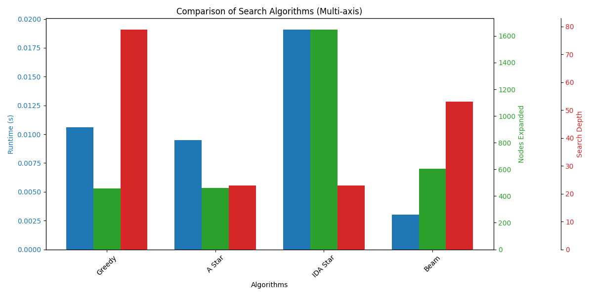
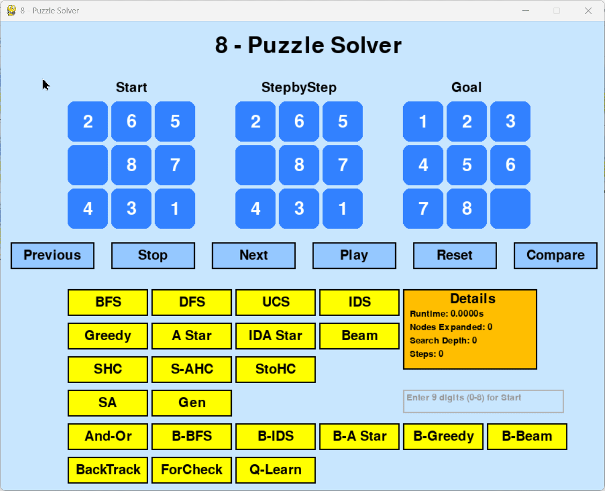
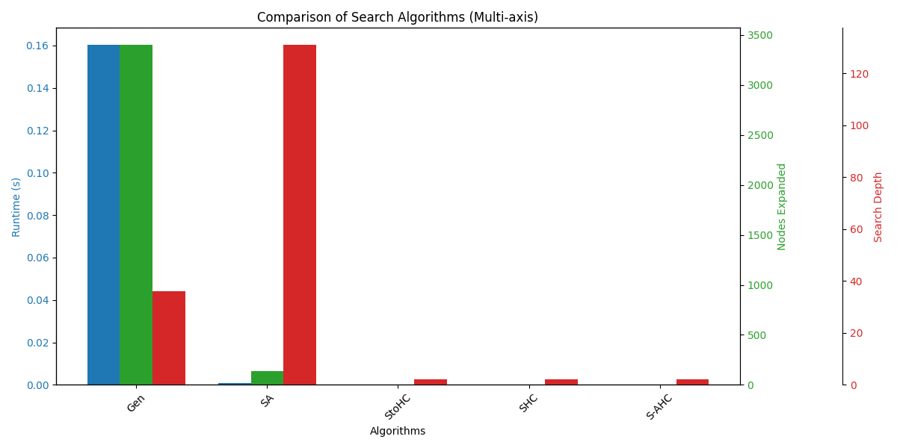
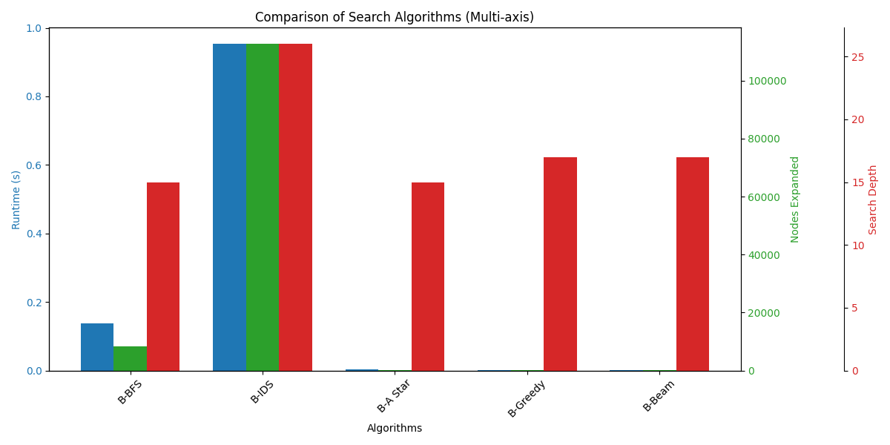
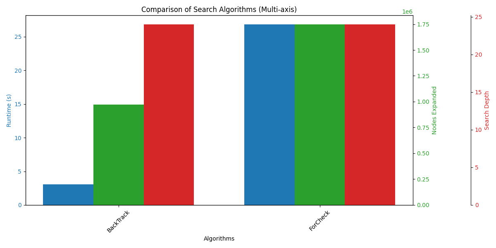

# **🔢 8-Puzzle Solver using AI Search Algorithms**

## Tác giả:

- **Lê Vũ Hào** (https://github.com/House1904/Personal_Project_AI?tab=readme-ov-file)

- **MSSV:** 23133020

- **Trường:** Đai học Sư phạm Kỹ thuật Thành phố Hồ Chí Minh

- **Môn học:** Trí tuệ nhân tạo (Artificial Intelligence)


---

## 1. Mô tả về dự án

Dự án này triển khai giải pháp cho bài toán 8-Puzzle cổ điển bằng nhiều thuật toán tìm kiếm AI khác nhau. 8-Puzzle là trò chơi giải đố trượt, trong đó mục tiêu là sắp xếp lại các ô để tạo thành một chuỗi đã sắp xếp. Trò chơi được biểu diễn dưới dạng lưới 3x3, thiếu một ô (được biểu diễn bằng một khoảng trống).

Người giải sẽ lấy cấu hình ban đầu của câu đố và cố gắng đạt đến trạng thái mục tiêu (thường là: `1 2 3 4 5 6 7 8 0`, trong đó `0` là ô trống) bằng cách áp dụng nhiều chiến lược tìm kiếm khác nhau. Dự án bao gồm giao diện đồ họa để trực quan hóa từng bước của quá trình giải và bảng kết quả để so sánh hiệu suất của các thuật toán.

---

## 2. Mục tiêu

Mục tiêu của dự án là xây dựng một hệ thống giải bài toán 8-Puzzle bằng các thuật toán Tìm kiếm trong Trí tuệ nhân tạo (AI Search Algorithms). Hệ thống cho phép:

- Tìm lời giải hợp lệ từ trạng thái ban đầu đến trạng thái mục tiêu.

- So sánh hiệu quả của nhiều thuật toán dựa trên các tiêu chí như:

  - Thời gian chạy (Runtime)

  - Số lượng node được mở rộng (Nodes Expanded)

  - Độ sâu lời giải (Search Depth)

  - Số bước trong lời giải (Steps)

---

## 3. Nội dung

Dự án mô phỏng trò chơi 8-Puzzle – một bài toán sắp xếp trên lưới 3x3 với một ô trống (0). Mục tiêu là đưa các số từ 1 đến 8 về đúng thứ tự (mặc định là [[1, 2, 3], [4, 5, 6], [7, 8, 0]]) bằng cách di chuyển ô trống.

**Dự án bao gồm:**

- Giao diện đồ họa bằng Pygame: trực quan hóa trạng thái bắt đầu, trạng thái đích, và quá trình giải theo từng bước.

- Lựa chọn nhiều thuật toán khác nhau từ Uninformed Search, Informed Search, Local Search, Genetic, And-Or Graph Search, Belief-based Search, CSP Search và cuối cùng là Q-Learning.

- Cơ chế các nút điều khiển để theo dõi quá trình giải và hiển thị kết quả chi tiết sau mỗi lần giải.

- Hỗ trợ nhập trạng thái ban đầu (start state) trực tiếp từ giao diện cho cả trạng thái bình thường và trạng thái niềm tin.

- Sau khi chạy các thuật toán có thể trực quan hoá bằng biểu đồ cột để so sánh hiệu suất của các thuật toán.

- Ghi log vào file CSV sau mỗi lần chạy với thông tin Start State, Algorithm, Runtime, Nodes Expanded, Search Depth để dùng cho thống kê hoặc so sánh cùng lúc các thuật toán trong nhiều nhóm thuật toán.

---

## 4. Các thuật toán tìm kiếm AI được triển khai

### 4.1. Uninformed Search Algorithms

Thuật toán tìm kiếm không thông tin (Uninformed Search Algorithms), còn gọi là thuật toán tìm kiếm mù (blind search algorithms), là một lớp thuật toán không sử dụng bất kỳ kiến thức đặc thù nào về miền bài toán ngoài các thông tin được mô tả trong đề bài. Các thuật toán này sẽ không sử dụng hàm heuristic – một hàm đánh giá để ước lượng khoảng cách đến đích. Vì không có sự định hướng cụ thể, chúng khám phá không gian trạng thái một cách hệ thống, thường theo các chiến lược đơn giản như duyệt theo chiều rộng hoặc chiều sâu.

Thuật toán tìm kiếm không thông tin chỉ dựa trên:

- Trạng thái ban đầu (Initial State)

- Tập các hành động hợp lệ tại mỗi trạng thái (Actions/Operators)

- Mục tiêu (Goal State hoặc Goal Test)

Nói cách khác, chúng không có thêm hiểu biết gì về bản chất của bài toán ngoài cấu trúc mô tả ban đầu.

#### 4.1.1. BFS (Breadth-First Search) - Tìm kiếm theo chiều rộng,

Thuật toán **BFS** (Breadth-First Search) là một chiến lược tìm kiếm không thông tin (uninformed search) thường dùng để giải bài toán 8-Puzzle. Mục tiêu là tìm dãy bước di chuyển để đưa trạng thái ban đầu của bảng 3x3 về đúng trạng thái đích đã cho.

BFS hoạt động theo nguyên tắc mở rộng các trạng thái theo từng tầng (theo chiều rộng), nghĩa là xét hết tất cả các trạng thái có cùng số bước trước khi sang mức sâu hơn. Điều này giúp đảm bảo lời giải tìm được sẽ là lời giải có số bước ít nhất (độ dài ngắn nhất).

Thuật toán sử dụng một hàng đợi (queue) để lưu các trạng thái đang chờ xử lý. Mỗi phần tử trong hàng đợi gồm trạng thái hiện tại và đường đi đã thực hiện để đến đó. Tại mỗi bước, thuật toán lấy trạng thái đầu tiên ra khỏi hàng đợi, kiểm tra xem nó có phải trạng thái đích không. Nếu chưa, thuật toán tạo ra các trạng thái con bằng cách di chuyển ô trống (0) theo bốn hướng hợp lệ (lên, xuống, trái, phải).

Để tránh lặp vô hạn, thuật toán sử dụng một tập visited để lưu các trạng thái đã được duyệt. Mỗi trạng thái được lưu dưới dạng tuple để dễ kiểm tra trùng lặp. Nếu một trạng thái mới chưa từng được duyệt, nó sẽ được thêm vào hàng đợi cùng với đường đi mới tương ứng.

Khi tìm được trạng thái đích, thuật toán trả về bốn thông tin: đường đi từ đầu đến đích, thời gian thực thi, số trạng thái đã mở rộng, và độ dài lời giải. BFS đảm bảo tìm được lời giải ngắn nhất nếu tồn tại, nhưng có thể tốn nhiều bộ nhớ và thời gian khi không gian trạng thái quá lớn.


#### 4.1.2. DFS (Depth-First Search) - Tìm kiếm theo chiều sâu,

Thuật toán **DFS** (Depth-First Search) là một chiến lược tìm kiếm không thông tin, áp dụng để giải bài toán 8-Puzzle bằng cách ưu tiên đi sâu vào từng nhánh trạng thái trước khi quay lại xét các nhánh khác. Mục tiêu vẫn là tìm dãy bước di chuyển từ trạng thái ban đầu đến trạng thái đích thông qua hoán đổi ô trống (0) với các ô xung quanh.

DFS sử dụng một ngăn xếp (stack) để lưu trữ các trạng thái cần duyệt. Mỗi phần tử trong stack gồm: trạng thái hiện tại, đường đi đã thực hiện và độ sâu hiện tại. Tại mỗi bước, thuật toán lấy trạng thái cuối cùng ra khỏi stack (LIFO), kiểm tra xem có phải trạng thái đích không. Nếu đúng thì trả về lời giải.

Nếu chưa đạt tới trạng thái đích và chưa vượt quá độ sâu giới hạn (max_depth), thuật toán sẽ tạo ra các trạng thái con bằng cách di chuyển ô trống theo 4 hướng hợp lệ. Các trạng thái chưa từng xuất hiện sẽ được thêm vào stack để tiếp tục duyệt.

Để tránh lặp vô hạn, tập visited được dùng để lưu các trạng thái đã duyệt. Mỗi trạng thái được chuyển về dạng tuple để dễ kiểm tra trùng lặp.

Thuật toán trả về bốn thông tin chính: đường đi lời giải, thời gian thực thi, số lượng trạng thái đã mở rộng, và độ dài lời giải. DFS có ưu điểm là tiết kiệm bộ nhớ hơn BFS, nhưng không đảm bảo tìm được lời giải ngắn nhất và có thể bị kẹt trong nhánh sai nếu không giới hạn độ sâu.


#### 4.1.3. UCS (Uniform Cost Search) - Tìm kiếm có chi phí,

Thuật toán **UCS** (Uniform Cost Search) là một chiến lược tìm kiếm không thông tin, sử dụng cấu trúc hàng đợi ưu tiên (priority queue) để luôn mở rộng trạng thái có tổng chi phí thấp nhất từ trạng thái ban đầu. Trong bài toán 8-Puzzle, chi phí thường được tính là số bước di chuyển từ trạng thái ban đầu đến trạng thái hiện tại.

Thuật toán khởi đầu với hàng đợi ưu tiên chứa trạng thái gốc cùng chi phí bằng 0. Mỗi phần tử trong hàng đợi gồm: chi phí, trạng thái hiện tại và đường đi từ đầu đến trạng thái đó. Tại mỗi vòng lặp, UCS chọn ra trạng thái có chi phí nhỏ nhất để mở rộng trước (min-heap).

Từ trạng thái hiện tại, thuật toán tìm vị trí ô trống (0) và sinh ra các trạng thái con bằng cách hoán đổi ô trống với các ô xung quanh (trái, phải, trên, dưới). Với mỗi trạng thái con, nếu nó chưa từng được duyệt, thuật toán tính chi phí mới (cost + 1) và thêm vào hàng đợi ưu tiên.

Để tránh lặp, UCS cũng dùng tập visited lưu các trạng thái đã thăm. Khi trạng thái hiện tại trùng với trạng thái đích, thuật toán trả về: đường đi lời giải, thời gian chạy, số trạng thái mở rộng, và độ dài lời giải.

UCS đảm bảo tìm được lời giải có chi phí thấp nhất (nếu tồn tại), và thường có hiệu quả tương đương với BFS trong các bài toán mà mỗi bước đi có cùng chi phí. Tuy nhiên, UCS có thể tốn nhiều thời gian và bộ nhớ nếu không gian trạng thái quá lớn.


#### 4.1.4. IDS (Iterative Deepening Search) - Tìm kiếm sâu dần.

Thuật toán **IDS** (Iterative Deepening Search) là sự kết hợp giữa hai thuật toán tìm kiếm cổ điển: DFS (Depth-First Search) và BFS (Breadth-First Search). Mục tiêu của IDS là vừa tiết kiệm bộ nhớ như DFS, vừa đảm bảo tìm được lời giải ngắn nhất như BFS.

IDS thực hiện bằng cách lặp lại DFS nhiều lần, mỗi lần với giới hạn độ sâu (depth limit) tăng dần. Ở mỗi vòng lặp, thuật toán chỉ cho phép đi sâu tối đa đến độ sâu d, sau đó tăng d lên 1 và lặp lại quá trình cho đến khi tìm được trạng thái đích.

Phần cốt lõi của IDS là hàm depth_limited_search(), thực hiện tìm kiếm theo chiều sâu nhưng có giới hạn độ sâu. Tại mỗi bước, nếu đạt độ sâu bằng 0 mà chưa đến được trạng thái đích, thuật toán sẽ quay lui. Khi tìm thấy lời giải, nó sẽ xây dựng đường đi ngược từ trạng thái đích về trạng thái đầu.

IDS sử dụng một tập visited để tránh lặp trạng thái trong mỗi lần chạy DFS. Ở mỗi lần lặp theo độ sâu, tập visited được khởi tạo lại để duyệt chính xác các trạng thái ở mức sâu hiện tại.

Thuật toán trả về: đường đi từ start đến goal, thời gian chạy, số lượng trạng thái đã mở rộng và độ dài lời giải. IDS có hiệu suất bộ nhớ tốt (do dùng DFS ở từng vòng lặp) và vẫn đảm bảo tìm được lời giải tối ưu nếu chi phí mỗi bước là như nhau.


#### Biểu đồ cột so sánh hiệu suất các thuật toán tìm kiếm không có thông tin:


#### Nhận xét chung về hiệu suất thuật toán tìm kiếm không thông tin:

- BFS và UCS là lựa chọn tốt nếu ta cần giải pháp chắc chắn và tối ưu nhưng chấp nhận chi phí tính toán cao.

- DFS nhanh và tiết kiệm bộ nhớ nhưng không đảm bảo chất lượng lời giải.

- IDS là thuật toán thông minh hơn DFS nhưng đánh đổi bằng thời gian và số node mở rộng rất lớn, đặc biệt trong các bài toán không gian lớn.

Vì vậy, với các bài toán đơn giản, DFS hoặc BFS là lựa chọn tốt. Nhưng với môi trường phức tạp hơn, nên cân nhắc sử dụng các thuật toán có thông tin (heuristic) như A\*, Greedy,... để đạt hiệu quả cao hơn.

### 4.2. Informed Search Algorithms

Thuật toán tìm kiếm có thông tin, hay còn gọi là thuật toán tìm kiếm theo heuristic, là một thành phần cốt lõi trong lĩnh vực Trí tuệ nhân tạo (AI). Khác với các thuật toán tìm kiếm không thông tin (blind search), các thuật toán này sử dụng kiến thức đặc thù của bài toán (domain-specific knowledge) để hướng dẫn quá trình tìm kiếm, giúp tìm lời giải nhanh hơn và hiệu quả hơn.

Trong bối cảnh này, heuristic là một hàm đánh giá dùng để ước lượng chi phí còn lại từ trạng thái hiện tại đến mục tiêu. Thuật toán sẽ ưu tiên mở rộng các trạng thái được đánh giá là "gần mục tiêu hơn" dựa vào giá trị heuristic. Đây chính là "sự thông minh" của thuật toán.

Ví dụ: trong bài toán tìm đường, heuristic có thể là khoảng cách Euclidean từ điểm hiện tại đến đích.

#### 4.2.1. Greedy Best-First Search - Tìm kiếm dựa trên heuristics,

**Greedy Best-First Search** (Tìm kiếm tham lam tốt nhất) là thuật toán tìm kiếm có thông tin, dùng heuristic để dẫn hướng quá trình tìm kiếm. Mục tiêu là mở rộng trạng thái "gần mục tiêu nhất" theo đánh giá heuristic. Thuật toán sử dụng một hàng đợi ưu tiên. Mỗi trạng thái được gán điểm h(n) – là giá trị heuristic ước lượng khoảng cách còn lại đến đích. Trạng thái có h(n) nhỏ nhất sẽ được chọn mở rộng trước.

Trong 8-Puzzle, hàm heuristic là tổng khoảng cách Manhattan giữa vị trí hiện tại và vị trí đích của các ô (trừ ô trống). Điều này giúp thuật toán chọn các trạng thái có bố cục "gần giống đích" hơn. Greedy không quan tâm đến chi phí đã đi (g(n)), chỉ quan tâm đến h(n). Vì vậy nó có thể đi nhanh nhưng không đảm bảo tìm ra đường đi ngắn nhất.

Ưu điểm là nhanh và hiệu quả nếu heuristic tốt. Tuy nhiên, nhược điểm là dễ bị lạc hướng hoặc không tối ưu nếu heuristic kém chính xác.

Tóm lại, Greedy Best-First Search thích hợp với các bài toán cần tốc độ và có hướng dẫn rõ ràng, nhưng không lý tưởng khi yêu cầu giải pháp tối ưu.


#### 4.2.2. A\* Search - Tìm kiếm có chi phí và heuristics,

**A\*** Search là một thuật toán tìm kiếm có thông tin, kết hợp giữa chi phí đã đi (g(n)) và ước lượng còn lại (h(n)) để tìm ra đường đi tối ưu đến đích.

Thuật toán dùng hàng đợi ưu tiên. Mỗi trạng thái được đánh giá theo hàm:

> f(n) = g(n) + h(n)

Trong đó:

- g(n) là số bước đã đi (chi phí thực tế),

- h(n) là heuristic ước lượng khoảng cách còn lại.

Trong 8-Puzzle, heuristic được dùng là tổng khoảng cách Manhattan giữa các ô hiện tại và vị trí đúng của chúng trong trạng thái goal (trừ ô trống). A\* đảm bảo sẽ tìm được lời giải ngắn nhất nếu heuristic thỏa điều kiện chấp nhận được (admissible). Nó cân bằng giữa tìm kiếm đúng hướng và đảm bảo tối ưu.

Ưu điểm: Tìm được lời giải tối ưu, hiệu quả hơn BFS. Nhược điểm: Tốn nhiều bộ nhớ hơn Greedy do phải xét nhiều trạng thái hơn.

Tóm lại, A\* là một trong những thuật toán tìm kiếm mạnh mẽ nhất trong AI, phù hợp khi cần lời giải ngắn nhất và có thể thiết kế heuristic hợp lý.


#### 4.2.3. IDA\* Search - Tìm kiếm sâu dần và có chi phí tương tự A\*,

**IDA\*** (Iterative Deepening A*) là thuật toán kết hợp giữa A* và tìm kiếm sâu dần (Iterative Deepening). Thuật toán sử dụng chi phí f(n) = g(n) + h(n) như A\*, nhưng thay vì dùng hàng đợi ưu tiên, nó giới hạn tìm kiếm theo từng "ngưỡng" chi phí và tăng dần.

IDA\* bắt đầu với ngưỡng threshold = heuristic(start). Ở mỗi vòng lặp, thuật toán sẽ duyệt theo chiều sâu, nhưng chỉ mở rộng các trạng thái có f(n) ≤ threshold. Nếu không tìm được lời giải, threshold sẽ được tăng lên mức nhỏ nhất đã vượt quá giới hạn trước.

Quá trình tiếp tục như vậy cho đến khi tìm thấy trạng thái đích hoặc xác định không có lời giải. Heuristic sử dụng vẫn là tổng khoảng cách Manhattan như A\*.

Ưu điểm của IDA*: tiết kiệm bộ nhớ hơn A* vì không dùng hàng đợi lớn, chỉ cần stack theo DFS. Tuy nhiên, do phải lặp lại nhiều lần theo từng ngưỡng nên tổng thời gian có thể lâu hơn.

Tóm lại, IDA* phù hợp cho các bài toán có không gian trạng thái lớn nhưng vẫn cần đảm bảo tìm lời giải tối ưu với mức sử dụng bộ nhớ hợp lý. Đây là phiên bản tối ưu hóa theo chiều sâu của A*.


#### 4.2.4. Beam Search: Tìm kiếm bằng cách chọn các giải pháp tốt nhất trong một số lượng giới hạn.

**Beam Search** là thuật toán tìm kiếm cục bộ có hướng dẫn heuristic, nhưng chỉ giữ lại một số lượng trạng thái giới hạn (beam width) tại mỗi bước mở rộng. Nó giống Greedy Search nhưng được mở rộng song song cho nhiều nhánh tiềm năng.

Thuật toán bắt đầu từ trạng thái gốc, sinh các trạng thái con, sau đó chọn ra beam_width trạng thái tốt nhất (theo giá trị heuristic) để tiếp tục mở rộng ở bước sau. Những trạng thái khác sẽ bị loại bỏ để tiết kiệm bộ nhớ và thời gian.

Trong 8-Puzzle, Beam Search sử dụng khoảng cách Manhattan làm heuristic. Tại mỗi vòng lặp, thuật toán chỉ giữ lại các trạng thái có h(n) thấp nhất trong phạm vi giới hạn (beam_width).

Ưu điểm: tiết kiệm bộ nhớ, mở rộng song song các khả năng tốt nhất, dễ cài đặt. Nhược điểm: không đảm bảo tìm được lời giải, dễ bị loại bỏ sớm nhánh dẫn đến goal nếu beam_width quá nhỏ.

Tóm lại, Beam Search là sự cân bằng giữa hiệu quả và chi phí, phù hợp với các bài toán lớn cần giới hạn tài nguyên, nhưng cần chọn beam_width hợp lý để tránh bỏ sót lời giải.


#### Biểu đồ cột so sánh hiệu suất các thuật toán tìm kiếm có thông tin:



#### Nhận xét chung về hiệu suất thuật toán tìm kiếm có thông tin:

- A\* là lựa chọn hàng đầu nếu ta cần độ chính xác và hiệu quả cao.

- Greedy phù hợp với bài toán nhỏ và yêu cầu tốc độ cao.

- Beam Search là lựa chọn cân bằng giữa tốc độ và tài nguyên.

- IDA\* ít dùng trong thực tế do chi phí thời gian lớn, dù vẫn đảm bảo tối ưu.

Khi chọn thuật toán heuristic, nên ưu tiên A\* hoặc Greedy nếu heuristic dùng tốt (ví dụ: Manhattan distance với 8-Puzzle).

### 4.3. Local Search Algorithms

**Local Search Algorithms** (thuật toán tìm kiếm cục bộ) là các thuật toán tập trung vào việc cải thiện trạng thái hiện tại bằng cách xem xét các trạng thái lân cận (neighbor states). Thay vì tìm đường đi từ trạng thái ban đầu đến đích như các thuật toán truyền thống, local search chỉ quan tâm đến việc tối ưu hóa trạng thái.

Thuật toán tìm kiếm cục bộ thường được dùng khi:

- Không gian trạng thái quá lớn để lưu trữ hoặc duyệt toàn bộ.

- Bài toán là bài toán tối ưu hóa thay vì tìm đường (ví dụ: sắp xếp, lập lịch).

- Không cần hoặc không xác định rõ trạng thái đích.

Local search thường không đảm bảo tìm ra lời giải tối ưu toàn cục, nhưng chạy nhanh, đơn giản, và hiệu quả với bài toán lớn. Đây là nền tảng quan trọng trong các hệ thống AI thực tiễn như: lập thời khóa biểu, điều phối xe, giải sudoku,...

#### 4.3.1. Simple Hill Climbing - Tìm kiếm bằng cách di chuyển đến vị trí tốt hơn,

**Simple Hill Climbing** là thuật toán tìm kiếm cục bộ hoạt động bằng cách liên tục di chuyển đến trạng thái lân cận tốt hơn, dựa trên đánh giá bằng hàm heuristic. Nó giống như người leo núi, luôn chọn bước đi lên cao hơn hiện tại.

Tại mỗi bước, thuật toán duyệt qua các trạng thái hàng xóm của trạng thái hiện tại. Nếu tìm thấy trạng thái có heuristic thấp hơn (gần mục tiêu hơn), nó sẽ chuyển sang đó. Quá trình lặp lại cho đến khi:

- Tìm được trạng thái đích, hoặc

- Không còn trạng thái nào tốt hơn → rơi vào local maximum (đỉnh cục bộ).

Trong 8-Puzzle, thuật toán dùng khoảng cách Manhattan để đánh giá độ gần với trạng thái đích. Trạng thái tốt hơn là trạng thái có tổng khoảng cách nhỏ hơn.

Ưu điểm: đơn giản, dễ cài đặt, không cần lưu nhiều trạng thái. Nhược điểm: dễ kẹt ở đỉnh cục bộ, không đảm bảo tìm ra lời giải tối ưu hoặc thậm chí không đến được đích.

Tóm lại, Simple Hill Climbing phù hợp với các bài toán nhỏ hoặc có bề mặt tìm kiếm "trơn tru", nhưng không phù hợp với bài toán có nhiều đỉnh giả hoặc bẫy cục bộ.


#### 4.3.2. Steepest Ascent Hill Climbing - Tìm kiếm bằng cách di chuyển đến vị trí tốt nhất,

**Steepest Ascent Hill Climbing** là phiên bản cải tiến của Simple Hill Climbing. Thay vì chọn bất kỳ hàng xóm nào tốt hơn, thuật toán sẽ duyệt qua tất cả các trạng thái hàng xóm và chọn trạng thái tốt nhất (có heuristic thấp nhất) để di chuyển.

Ở mỗi bước, thuật toán so sánh tất cả hàng xóm và chọn trạng thái có giá trị heuristic nhỏ nhất. Nếu không có hàng xóm nào tốt hơn trạng thái hiện tại, thuật toán dừng lại tại đỉnh cục bộ.

Trong 8-Puzzle, tiêu chí đánh giá vẫn là tổng khoảng cách Manhattan giữa trạng thái hiện tại và trạng thái đích. Trạng thái “dốc nhất” là trạng thái giảm được nhiều nhất giá trị heuristic.

Ưu điểm: dễ cài đặt, ít tốn bộ nhớ, chọn nước đi thông minh hơn Simple Hill Climbing. Nhược điểm: vẫn có thể kẹt ở local maximum, plateau (vùng phẳng), hoặc ridge (rìa dốc).

Tóm lại, Steepest Ascent Hill Climbing thường hiệu quả hơn phiên bản đơn giản, nhưng vẫn không đảm bảo tìm được lời giải tối ưu. Thường cần cải tiến thêm (như random restart hoặc simulated annealing) để tránh kẹt.


#### 4.3.3. Stochastic Hill Climbing - Tìm kiếm bằng cách di chuyển đến vị trí tốt hơn với xác suất,

**Stochastic Hill Climbing** là một biến thể của thuật toán leo đồi, trong đó thuật toán không chọn trạng thái tốt nhất, mà chọn ngẫu nhiên một trạng thái tốt hơn trong số các hàng xóm.

Ở mỗi bước, thuật toán tạo danh sách các trạng thái lân cận có giá trị heuristic tốt hơn trạng thái hiện tại. Sau đó, thay vì chọn "tốt nhất", thuật toán chọn ngẫu nhiên một trạng thái bất kỳ trong số đó để di chuyển tiếp.

Heuristic vẫn là khoảng cách Manhattan trong bài toán 8-Puzzle. Việc chọn ngẫu nhiên giúp thuật toán tránh bị kẹt sớm tại các đỉnh cục bộ nhỏ, nhưng vẫn có thể rơi vào bẫy nếu không còn hàng xóm tốt hơn.

Ưu điểm: đơn giản, nhanh, có khả năng vượt qua đỉnh cục bộ nhẹ, tốt hơn Simple Hill Climbing trong một số trường hợp.
Nhược điểm: vẫn không đảm bảo đến được trạng thái đích, kết quả phụ thuộc vào may mắn.

Tóm lại, Stochastic Hill Climbing là một phương pháp tìm kiếm nhẹ và dễ cài đặt, thích hợp để thử nhanh trên các bài toán có nhiều điểm kẹt nhỏ, nhưng không nên dùng nếu cần sự ổn định và chắc chắn.


#### 4.3.4. Simulated Annealing - Tìm kiếm bằng cách di chuyển đến vị trí tốt hơn với xác suất giảm dần,

**Simulated Annealing** là một thuật toán tìm kiếm cục bộ mô phỏng quá trình nung nóng và làm nguội kim loại để đạt trạng thái ổn định. Thuật toán cho phép di chuyển tới trạng thái xấu hơn với xác suất giảm dần theo thời gian.

Ở mỗi bước, thuật toán chọn ngẫu nhiên một trạng thái hàng xóm. Nếu trạng thái đó tốt hơn (heuristic giảm), nó sẽ chuyển sang đó. Nếu không, vẫn có xác suất chấp nhận trạng thái xấu hơn, dựa vào nhiệt độ và mức độ xấu (delta_e).

Nhiệt độ (temperature) sẽ giảm dần theo hệ số cooling_rate sau mỗi bước. Càng về sau, thuật toán càng ít chấp nhận trạng thái xấu → quá trình tìm kiếm dần ổn định.

Ưu điểm: có khả năng thoát khỏi đỉnh cục bộ, vượt qua bẫy mà các thuật toán leo đồi thường mắc phải. Nhược điểm: kết quả không ổn định, phụ thuộc vào thông số như nhiệt độ ban đầu, tốc độ làm nguội.

Tóm lại, Simulated Annealing là một giải pháp hiệu quả cho các bài toán tối ưu phức tạp, có nhiều đỉnh cục bộ, nhưng cần điều chỉnh tham số cẩn thận để đạt hiệu quả tốt.


#### 4.3.5. Genetic Algorithm: Tìm kiếm bằng cách di chuyển đến vị trí tốt hơn thông qua quá trình chọn lọc và lai ghép.

**Genetic Algorithm (GA)** là thuật toán tìm kiếm cục bộ dựa trên nguyên lý tiến hóa tự nhiên. Nó sử dụng các kỹ thuật như chọn lọc, lai ghép (crossover) và đột biến (mutation) để tạo ra thế hệ lời giải ngày càng tốt hơn.

Mỗi cá thể (individual) là một dãy di chuyển từ trạng thái ban đầu. Thuật toán bắt đầu bằng việc khởi tạo ngẫu nhiên một quần thể cá thể. Mỗi cá thể được đánh giá bằng hàm fitness, dựa trên khoảng cách Manhattan đến trạng thái đích.

Trong mỗi vòng lặp:

- Chọn lọc: giữ lại các cá thể tốt nhất.

- Lai ghép: tạo cá thể con bằng cách trộn một phần của hai cha mẹ.

- Đột biến: thay đổi ngẫu nhiên một bước trong cá thể để tăng đa dạng.

Nếu một cá thể đưa ra trạng thái khớp với goal, thuật toán kết thúc và trả về đường đi.

Ưu điểm: có thể tìm được lời giải trong không gian lớn, không cần gradient, tránh kẹt local maximum. Nhược điểm: không đảm bảo tối ưu, phụ thuộc nhiều vào tham số như population size, mutation rate, số thế hệ.

Tóm lại, Genetic Algorithm là phương pháp mạnh mẽ cho các bài toán tìm kiếm phức tạp, nhưng cần tinh chỉnh kỹ lưỡng để đạt hiệu quả cao.



#### Biểu đồ cột so sánh hiệu suất các thuật toán tìm kiếm cục bộ:



#### Nhận xét chung về hiệu suất thuật toán tìm kiếm cục bộ:

- Genetic Algorithm: Thời gian chậm, mở rộng nhiều node nhưng vẫn chưa đạt độ sâu tối ưu. Thích hợp cho bài toán phức tạp, nhưng cần tinh chỉnh tham số tốt hơn.

- Simulated Annealing (SA): Rất nhanh, độ sâu lớn → nhưng thường không tìm được lời giải. Cần cải thiện các tham số để tối ưu thuật toán.

- SHC, S-AHC, StoHC (Hill Climbing): Chạy cực nhanh, nhưng dễ rơi vào local optimum (vùng kẹt). Độ sâu nhỏ → không tìm được lời giải cho các map khó.

### 4.4. Search Algorithms in Complex Environment

Trong các môi trường phức tạp, chẳng hạn như môi trường không chắc chắn, môi trường với niềm tin (belief), hoặc môi trường có giới hạn thông tin, việc tìm kiếm lời giải không thể chỉ dựa vào trạng thái đầu đầy đủ. Thay vào đó, các thuật toán cần xử lý thêm yếu tố như:

- **Thiếu thông tin**: trạng thái ban đầu có thể chỉ biết một phần.

- **Không chắc chắn**: nhiều trạng thái khả dĩ có thể là thật.

- **Sự không đầy đủ**: phải suy đoán các phần còn thiếu.

Để giải quyết, chúng ta sử dụng các kỹ thuật mở rộng như:

#### 4.4.1. And-Or Graph Search Algorithm

**And-Or Graph Search** là thuật toán mở rộng của tìm kiếm truyền thống, dùng để xử lý các bài toán có cấu trúc chia nhỏ mục tiêu (subgoals). Trong đồ thị AND-OR:

- Nút OR đại diện cho việc chọn một trong nhiều hướng đi.

- Nút AND yêu cầu giải quyết đồng thời nhiều nhánh con.

Trong bài toán 8-Puzzle, ta mô phỏng thuật toán này bằng cách sử dụng hai hàm:

- **or_search**: duyệt từng nhánh lựa chọn một trạng thái kế tiếp.

- **and_search**: gọi lại or_search, mô phỏng việc giải quyết đồng thời các nhánh con.

Thuật toán hoạt động giống DFS có giới hạn độ sâu (max_depth). Nó tránh lặp bằng cách lưu lại các trạng thái đã duyệt (visited) và dừng nếu đạt đến goal hoặc vượt quá giới hạn.

Ưu điểm: mô hình hóa tốt các bài toán phức tạp có nhiều điều kiện rẽ nhánh. Nhược điểm: trong 8-Puzzle (bài toán tuyến tính), And-Or Search hoạt động giống DFS, nên không thể hiện rõ sức mạnh của mô hình AND-OR thực thụ.

Tóm lại, And-Or Graph Search phù hợp cho các bài toán như lập kế hoạch nhiều bước, giải quyết tình huống bất định, hoặc bài toán phân rã mục tiêu, nhưng trong 8-Puzzle, nó chủ yếu mang tính mô phỏng và minh họa lý thuyết.


#### 4.4.2. Belief State Search Algorithms:

Trong môi trường không chắc chắn, đầu vào không phải là một trạng thái đầy đủ, mà là một trạng thái niềm tin – chỉ biết một vài ô trong ma trận 8-Puzzle. Mục tiêu là sinh ra tất cả các trạng thái hợp lệ từ thông tin ban đầu và áp dụng thuật toán tìm kiếm để giải bài toán. Dưới đây là các biến thể của thuật toán tìm kiếm áp dụng cho belief state:

- **Belief-BFS**: Áp dụng BFS cho từng trạng thái hoàn chỉnh được sinh ra từ trạng thái niềm tin. Duyệt theo chiều rộng với độ sâu tăng dần.


- **Belief-IDS**: Duyệt các trạng thái hoàn chỉnh theo chiều sâu tăng dần. Với mỗi độ sâu, duyệt toàn bộ các nhánh trước khi tăng giới hạn.


- **Belief-A\***: Mỗi trạng thái sinh ra sẽ được đánh giá theo tổng chi phí: f(n) = g(n) + h(n). Trong đó g(n) là chi phí từ đầu đến trạng thái hiện tại, h(n) là heuristic (tổng khoảng cách Manhattan).


- **Belief-Greedy**: Chỉ sử dụng heuristic h(n) để đánh giá, không tính chi phí đã đi. Tập trung vào trạng thái có vẻ gần đích nhất.


- **Belief-Beam**: Tìm kiếm theo chiều rộng nhưng giới hạn số lượng trạng thái được giữ lại mỗi vòng (beam width).


#### Biểu đồ cột so sánh hiệu suất các thuật toán tìm kiếm trong môi trường phức tạp:



#### Nhận xét chung về hiệu suất thuật toán tìm kiếm trong môi trường phức tạp:

- Belief-A\* và Belief-Greedy cho kết quả rất nhanh với thời gian chạy nhỏ, ít node được mở rộng, đồng thời vẫn đạt được độ sâu mong muốn.

- Belief-Beam cũng hoạt động ổn định với tốc độ nhanh, đặc biệt hiệu quả với các cấu hình trạng thái không đầy đủ.

- Belief-IDS tiêu tốn thời gian và số lượng node mở rộng rất lớn, vì phải thử nhiều tầng lặp lại cho tất cả các trạng thái khả dĩ từ belief → không tối ưu cho môi trường lớn.

- Belief-BFS có thời gian giải tương đối lâu do phải kiểm tra toàn bộ tổ hợp các trạng thái hoàn chỉnh sinh từ belief.

### 4.5. CSP Algorithms

#### 4.5.1. Backtracking Algorithm

Giải bài toán bằng cách thử từng giá trị cho biến theo thứ tự, kiểm tra ràng buộc sau mỗi bước. Nếu phát hiện xung đột, thuật toán quay lui (backtrack) để thử giá trị khác.


#### 4.5.2. Forward Checking Algorithm

Mở rộng thuật toán backtracking bằng cách, sau mỗi lần gán biến, loại bỏ các giá trị không hợp lệ khỏi miền giá trị của các biến còn lại. Điều này giúp phát hiện sớm mâu thuẫn và giảm đáng kể không gian tìm kiếm.


#### Biểu đồ cột so sánh hiệu suất các thuật toán tìm kiếm trong môi trường ràng buộc:



#### Nhận xét chung về hiệu suất thuật toán tìm kiếm trong môi trường ràng buộc:

- Backtracking vẫn khả thi hơn khi áp dụng vào 8-Puzzle trong môi trường ràng buộc.

- Forward Checking không phù hợp cho bài toán này vì chi phí tính toán bổ sung không mang lại lợi ích rõ ràng.

Trong tương lai, nên kết hợp CSP + Heuristics để rút ngắn thời gian và giảm số node mở rộng.

### 4.6. Q-Learning (Reinforcement Learning)

Q-Learning là một thuật toán học tăng cường (Reinforcement Learning) không mô hình (model-free), giúp tác nhân học cách hành động tốt nhất trong một môi trường thông qua việc thử nghiệm và rút kinh nghiệm từ phần thưởng nhận được.

Q-Learning học một hàm giá trị Q(state, action) – đại diện cho lợi ích kỳ vọng của việc thực hiện một hành động tại một trạng thái cụ thể, sau đó đi theo chính sách greedy (chọn hành động có Q-value cao nhất) để tìm đường đi tối ưu.

**Các thành phần chính:**

- Q-table: bảng lưu giá trị Q cho mỗi cặp (trạng thái, hành động)

- Alpha (α): tốc độ học – mức độ điều chỉnh Q-value mới

- Gamma (γ): hệ số chiết khấu – tầm quan trọng của phần thưởng tương lai

- Epsilon (ε): tỷ lệ khám phá – xác suất chọn hành động ngẫu nhiên để khám phá


---

## 5. Yêu cầu sử dụng chương trình

Để chạy được chương trình 8-Puzzle Solver trên máy của bạn, bạn cần chuẩn bị các yêu cầu sau:

- **Python 3.x**: Cài đặt Python 3.x trên máy tính của bạn.

- **Pygame**: Cài đặt Pygame để chạy chương trình...

---

## 6. Cách sử dụng chương trình 8 - Puzzle Solver

### 1. Tải mã nguồn: Clone dự án về máy bằng Git

```
git clone https://github.com/House1904/Personal_Project_AI.git
cd Personal_Project_AI
```

### 2. Cài đặt thư viện cần thiết

Trước khi chạy chương trình, bạn cần cài đặt các thư viện sau:

```
pip install pygame matplotlib
```

Một số thư viện khác như random, math, heapq, collections, copy, pickle... là mặc định có sẵn trong Python.

### 3. Chạy chương trình chính

```
python main.py
```

### 4. Nhập trạng thái ban đầu

**Nhập trạng thái đầu:** Tại ô nhập liệu bên dưới giao diện, bạn có thể nhập trạng thái bắt đầu của 8-puzzle.


- Nhập 9 ký tự, bao gồm các chữ số từ 0 đến 8

- 0 đại diện cho ô trống

Ví dụ hợp lệ: `265087431`

Hoặc nếu bạn muốn dùng thuật toán Belief Search, hãy dùng ký tự - để biểu thị các ô chưa biết: `123--45--`

Sau khi nhập, nhấn `Enter` để áp dụng trạng thái mới.

**Lưu ý:**

- Phải đủ đúng 9 ký tự

- Không được trùng lặp số

- Belief State phải có ít nhất 1 dấu - và không vi phạm tính hợp lệ của trạng thái

### 5. Chọn và chạy thuật toán

Chọn thuật toán bất kỳ trên giao diện, ví dụ:

- Tìm kiếm truyền thống: BFS, DFS, UCS, A Star, IDS,...

- Heuristic / Metaheuristic: Greedy, Beam, SA, Genetic, Hill Climbing,...

- Belief Search: B-BFS, B-A Star, B-IDS, B-Greedy, B-Beam

- Backtracking / CSP: BackTrack, ForCheck

- Q-Learning

### 6. Quan sát kết quả giải

Kết quả thuật toán được hiển thị trực quan:

- Start, Goal, và Step-by-Step được vẽ dưới dạng ma trận 3x3

- Animation mô phỏng từng bước di chuyển

- **Details Panel** hiển thị:

  - Thời gian thực thi (Runtime)

  - Số node mở rộng (Nodes Expanded)

  - Độ sâu tìm kiếm (Search Depth)

  - Tổng số bước đi (Steps)

### 7. Điều khiển animation

Bạn có thể điều hướng quá trình giải thông qua các nút:

- _Previous_: Quay về bước trước

- _Next_: Tiến tới bước tiếp theo

- _Stop_: Dừng animation hiện tại

- _Play_: Tiếp tục animation

- _Reset_: Khôi phục về trạng thái ban đầu

- _Compare_: So sánh hiệu suất các thuật toán đã chạy bằng biểu đồ

### 8. So sánh thuật toán

Sau khi thử nhiều thuật toán, nhấn Compare để hiển thị biểu đồ so sánh hiệu năng các thuật toán đã chạy:

- **Trục X**: Tên thuật toán

- **3 trục Y**: Runtime, Nodes Expanded, Search Depth

Dữ liệu được vẽ bằng `matplotlib`.

### 9. Ghi log kết quả

Kết quả của mỗi lần chạy thuật toán sẽ được lưu vào file CSV algorithm_results_log.csv, bao gồm:

- Trạng thái đầu vào

- Tên thuật toán

- Thời gian chạy

- Số node mở rộng

- Chiều sâu tìm kiếm

---

## 7. Kết quả đạt được và hướng phát triển

### 7.1. Kết quả đạt được

Sau quá trình xây dựng hệ thống giải bài toán 8-Puzzle bằng Python và thư viện PyGame, nhóm đã đạt được một số kết quả nổi bật như sau:

**Giao diện trực quan, dễ sử dụng:**

- Hệ thống sử dụng pygame để hiển thị ma trận trạng thái, quá trình giải animation, và bảng thống kê kết quả cho từng thuật toán.

- Cho phép nhập trạng thái đầu từ người dùng, hỗ trợ cả trạng thái đầy đủ và Belief State (trạng thái chứa các ô chưa biết).

**Hỗ trợ hơn 20 thuật toán khác nhau, bao gồm:**

- Thuật toán tìm kiếm truyền thống: BFS, DFS, UCS, IDS, A*, Greedy, Beam, IDA*

- Thuật toán Heuristic nâng cao: Hill Climbing, Simulated Annealing, Genetic, And-Or

- Thuật toán CSP: Backtracking, Forward Checking

- Thuật toán trong môi trường niềm tin (Belief State): B-BFS, B-IDS, B-A\*, B-Greedy, B-Beam

- Thuật toán học tăng cường: Q-Learning (đã huấn luyện hoặc huấn luyện online)

**Ghi log kết quả tự động:** Mỗi lần chạy thuật toán sẽ ghi dữ liệu (thời gian, số bước, node mở rộng...) vào file CSV algorithm_results_log.csv.

**So sánh hiệu suất:** Có chức năng Compare, hiển thị biểu đồ đa trục để so sánh hiệu quả các thuật toán.

**Hiệu quả hoạt động tốt với đa số các bản đồ:** Animation chạy mượt mà, kiểm soát linh hoạt với các nút Play, Next, Previous, Stop, Reset.

### 7.2. Hướng phát triển

Để mở rộng và nâng cấp hệ thống trong tương lai, có thể triển khai thêm:

**Tăng độ tương tác trong giao diện:**

- Cho phép kéo thả các ô để nhập trạng thái thay vì gõ tay.

- Thêm âm thanh hoặc hiệu ứng khi có lời giải để người dùng dễ nhận biết.

**Tự động sinh bài tập với độ khó khác nhau:**

- Tích hợp chức năng "Random Map" theo mức độ dễ → khó để người dùng luyện tập.

- Gợi ý thuật toán phù hợp nhất với từng độ khó.

**Thêm tính năng lưu & tải trạng thái:**

- Lưu lại lịch sử trạng thái đã giải để ôn lại hoặc trình chiếu.

- Cho phép tiếp tục giải từ trạng thái trước đó (resume).

**So sánh thuật toán bằng nhiều biểu đồ dễ hiểu hơn:**

- Biểu đồ cột, tròn, bảng xếp hạng để so sánh rõ ràng giữa các thuật toán.

- Gợi ý thuật toán tối ưu nhất theo từng tiêu chí: tốc độ, số bước, hiệu suất.

**Cải tiến Q-Learning:**

- Huấn luyện từ nhiều bản đồ khác nhau để tăng độ linh hoạt.

- Lưu trữ và tải lại Q-Table để không phải học lại mỗi lần chạy.

**Triển khai bản chạy online (WebApp):**

- Dùng Streamlit hoặc Flask để triển khai chương trình trên web.

- Dễ chia sẻ, dễ demo cho người khác xem hoặc sử dụng.

**Chế độ chơi thử (Play mode):**

- Người dùng tự thử giải bằng tay, chương trình ghi lại và so sánh với máy.

- Hữu ích cho luyện tư duy giải bài toán tìm đường.

---

## 8. Giấy phép và Bản quyền

Dự án này được cấp phép theo giấy phép [MIT License](LICENSE).

Bạn có thể sử dụng, sửa đổi và phân phối phần mềm này cho bất kỳ mục đích cá nhân hoặc thương mại nào, miễn là bạn giữ nguyên thông tin bản quyền và điều khoản giấy phép gốc.

---

## 9. Các nguồn tham khảo

[8-Puzzle Solver Web App - by AbdElRahman Osama](https://8-puzzle.streamlit.app/)

[eight-puzzle-solver - by Elzawawy](https://github.com/Elzawawy/eight-puzzle-solver)

[8-Puzzle-Solver - by yousefkotp](https://github.com/yousefkotp/8-Puzzle-Solver)

[8-puzzle-solver - by dgurkaynak](https://github.com/dgurkaynak/8-puzzle-solver?tab=readme-ov-file)

[pynpuzzle - by mahdavipanah](https://github.com/mahdavipanah/pynpuzzle)
